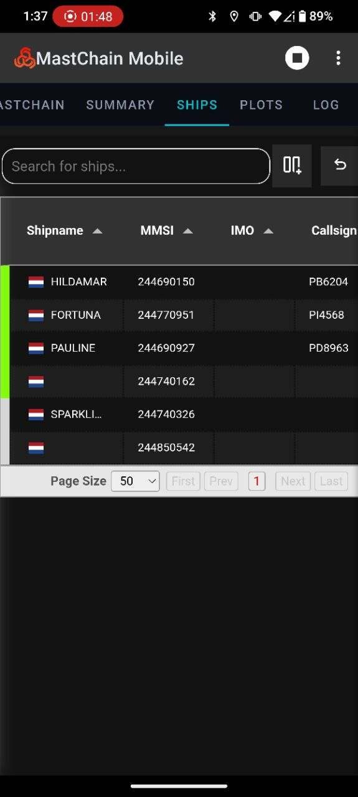
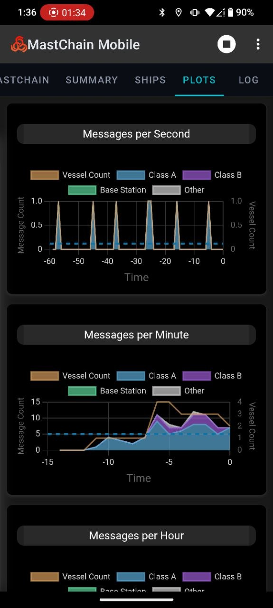
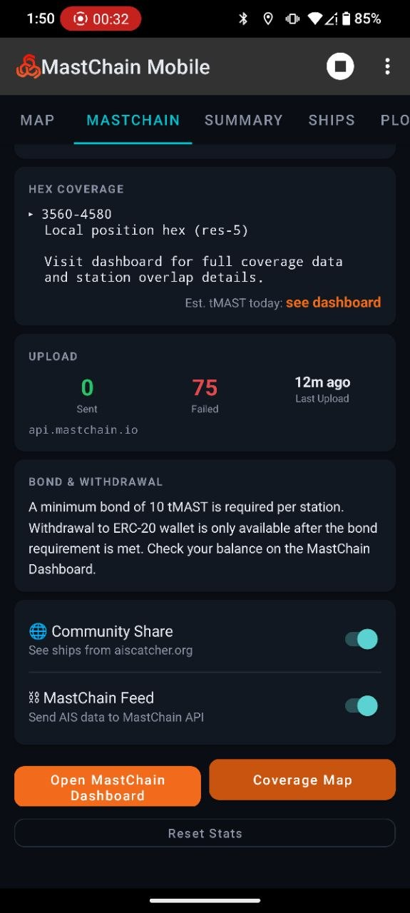
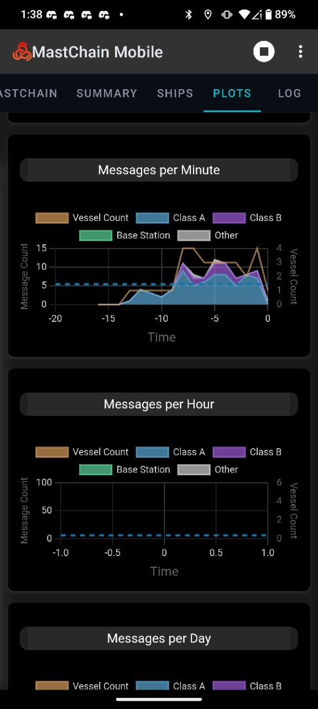
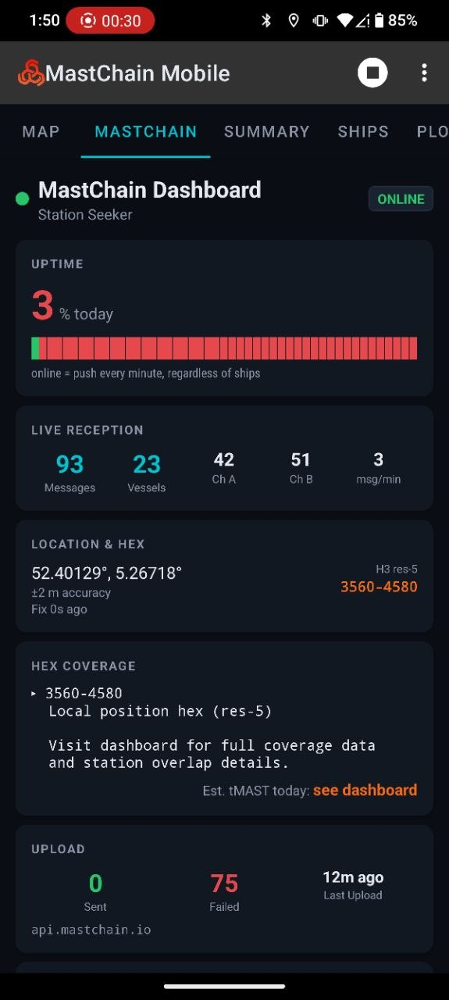
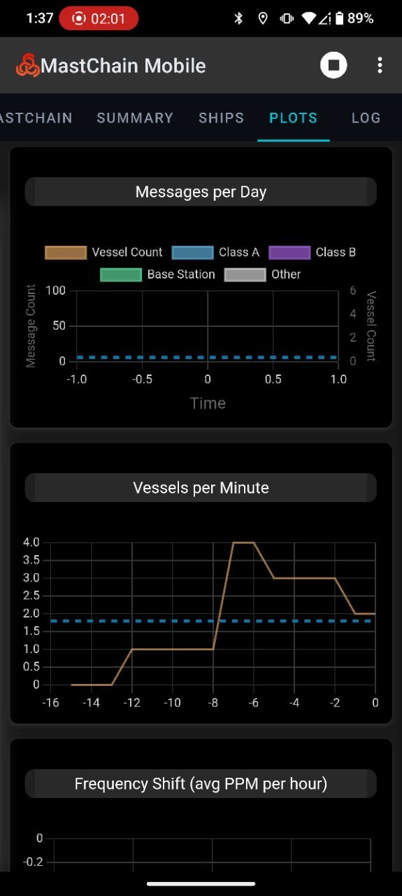
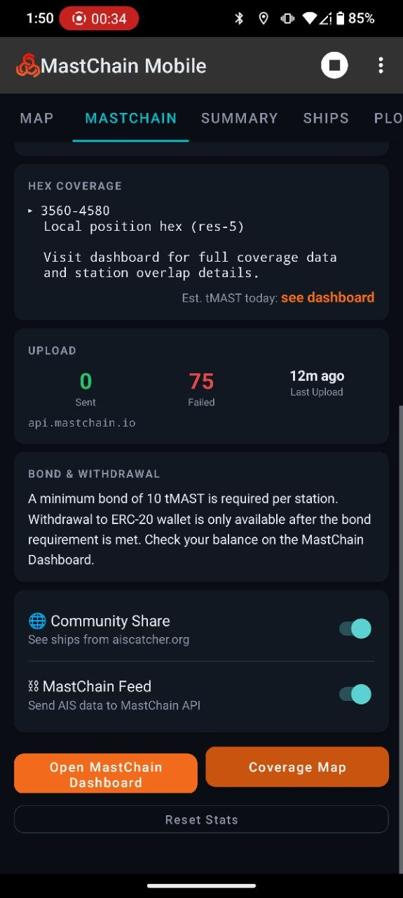
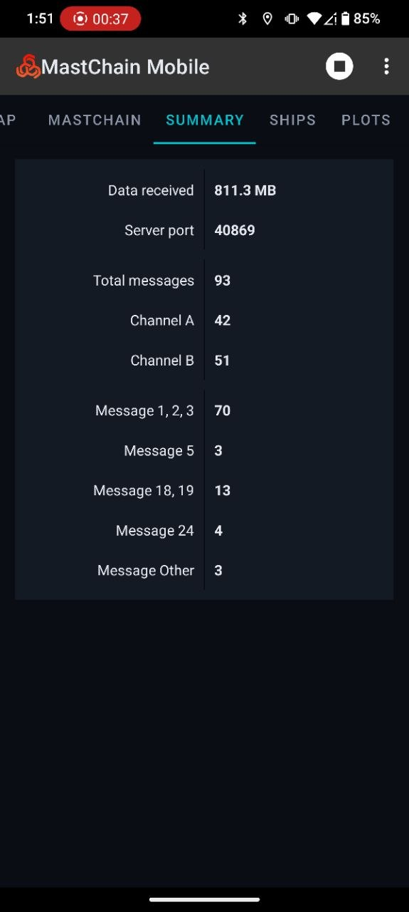
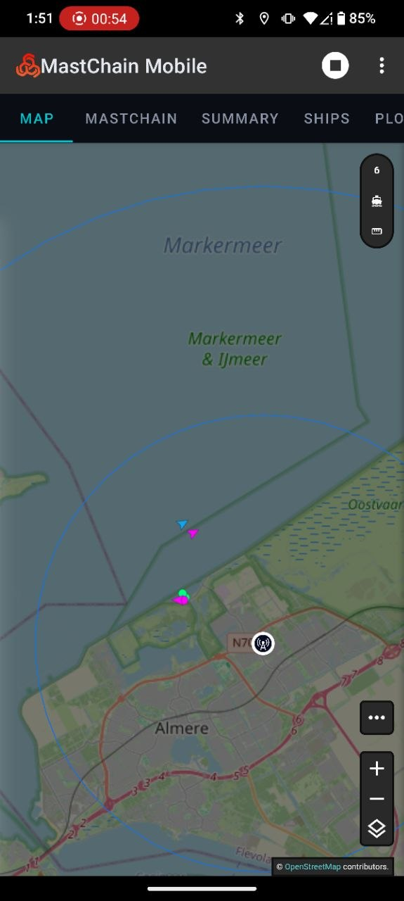

# MastChain AIS Station - Community Builds

Community-optimized builds of the MastChain AIS Catcher app for Android.

## ⚠️ Privacy Fix

The original builds contained **hardcoded personal credentials** as default values in the MastChain Feed settings. These have been **removed** — all credential fields are now blank:

| Setting | After (✅ Safe) |
|---------|-----------------|
| Username | *(blank — enter your own)* |
| Password | *(blank — enter your own)* |
| Station ID | *(blank — enter your own)* |
| URL | `https://api.mastchain.io/api/upload` *(unchanged)* |

> **You must enter your own MastChain credentials on first launch.**

---

## 📱 Available Builds

| Build | File | Size | Description |
|-------|------|------|-------------|
| **v3.0 Community** | `builds/mastchain-v3.0-community.apk` | 9.5 MB | Original v3.0 base, credentials removed |
| **Nav Finish Community** | `builds/mastchain-nav-finish-community.apk` | 9.5 MB | Nav-finish build with UI improvements, credentials removed |

---

## 🔧 What Changed — Build Comparison

### 🤖 Claude Code Changes (Nav Finish Build)
The nav-finish build was created with **Claude Code** and includes:

- ✅ Improved navigation bar flow
- ✅ Better station dashboard integration
- ✅ UI refinements for mobile screens
- ✅ Updated MastChain stats fragment layout
- ⚠️ Original personal credentials were hardcoded → **now removed**

### 🎮 SwitchBot/OpenClaw Changes (Both Builds)
Both community builds were sanitized by **SwitchBot (OpenClaw)** on the SwitchClaw device:

- ❌ **Removed** hardcoded email → **blank**
- ❌ **Removed** hardcoded password/token → **blank**
- ❌ **Removed** hardcoded station ID → **blank**
- ✅ All three fields now default to **empty** — users must enter their own credentials
- ✅ MastChain API URL unchanged (required for functionality)

### 📋 Quick Diff (SharedPreferences defaults)

```xml
<!-- BEFORE (dangerous - personal data in APK) -->
<EditTextPreference android:key="hUSERNAME" android:defaultValue="user@example.com" />
<EditTextPreference android:key="hPASSWORD" android:defaultValue="your_password_here" />
<EditTextPreference android:key="hSTATIONID" android:defaultValue="Station-01" />

<!-- AFTER (safe - blank defaults, user enters own credentials) -->
<EditTextPreference android:key="hUSERNAME" android:defaultValue="" />
<EditTextPreference android:key="hPASSWORD" android:defaultValue="" />
<EditTextPreference android:key="hSTATIONID" android:defaultValue="" />
```

---

## 🚀 Installation

1. Download the APK of your choice
2. Enable **"Install from unknown sources"** on your Android device
3. Install the APK
4. Open the app → **Settings** → **MastChain Feed**
5. Enter **your own** Username, Password, and Station ID

---

## 🔒 Security

- ✅ No personal data included in any build
- ✅ No API keys, tokens, or real credentials hardcoded
- ✅ All credential fields are **blank** — users must enter their own
- ✅ MastChain API URL points to the official endpoint

---

## 🏗️ Building from Source

If you want to rebuild from the decompiled source:

```bash
# Decompile
apktool d mastchain-v3.0.apk -o mastchain-decompiled

# Edit res/xml/preferences.xml - change defaults to blank
# Rebuild
apktool b mastchain-decompiled -o mastchain-community.apk
```

---

## 📸 Screenshots

<p align="center">
  
  
  
  
</p>

<p align="center">
  
  
  
  
</p>

<p align="center">
  
  
</p>

| # | File | Description |
|---|------|-------------|
| 1 | `screenshots/01-main-map.jpg` | Main map with ship positions |
| 2 | `screenshots/02-map-zoomed.jpg` | Map zoomed in on vessels |
| 3 | `screenshots/03-vessel-list.jpg` | Vessel list view |
| 4 | `screenshots/04-vessel-detail.jpg` | Vessel detail info |
| 5 | `screenshots/05-mastchain-dashboard.jpg` | MastChain dashboard tab |
| 6 | `screenshots/06-mastchain-feed-settings.jpg` | MastChain feed settings |
| 7 | `screenshots/07-settings-main.jpg` | Main settings screen |
| 8 | `screenshots/08-settings-rtl-sdr.jpg` | RTL-SDR settings |
| 9 | `screenshots/09-mastchain-stats.jpg` | MastChain statistics |
| 10 | `screenshots/10-app-about.jpg` | App info screen |

---

Built by the community, for the community 🤝